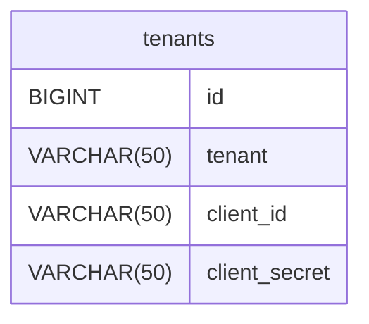
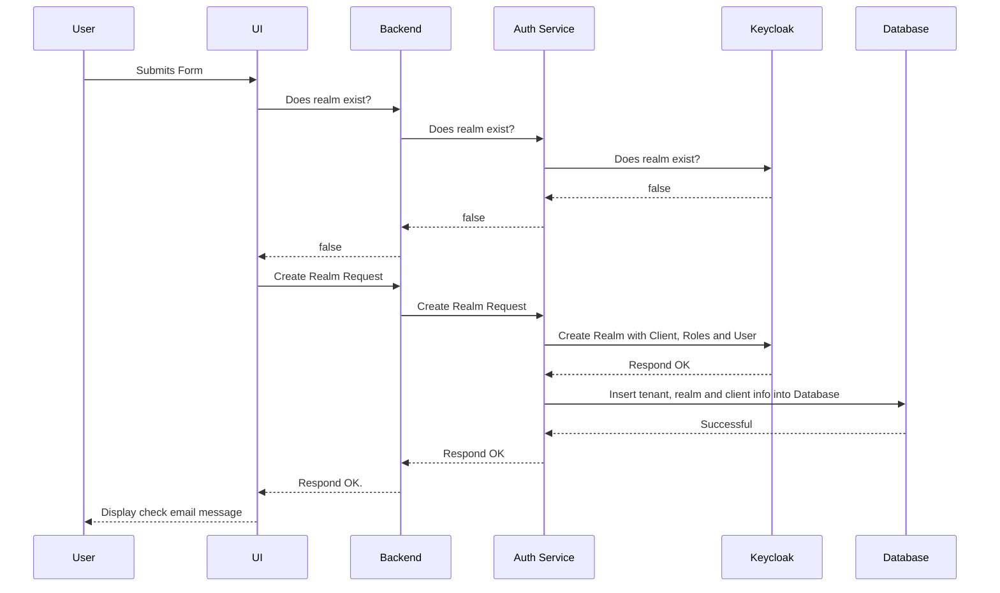
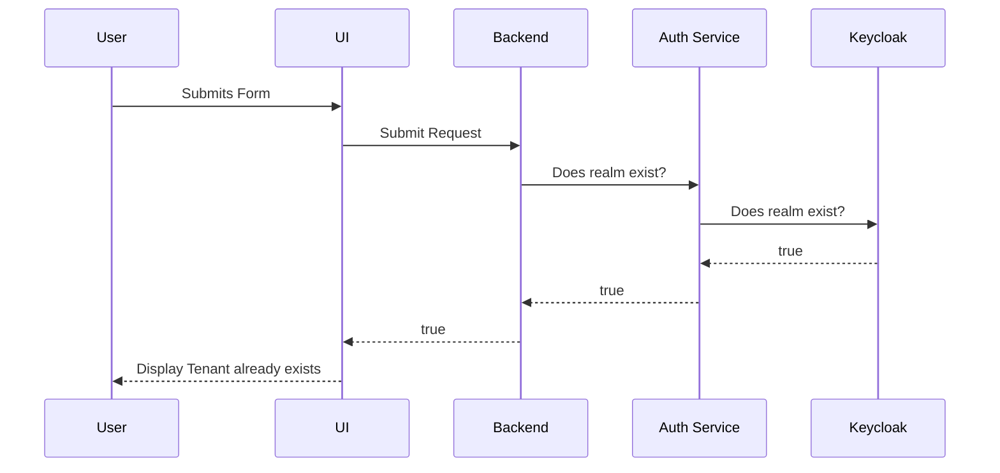
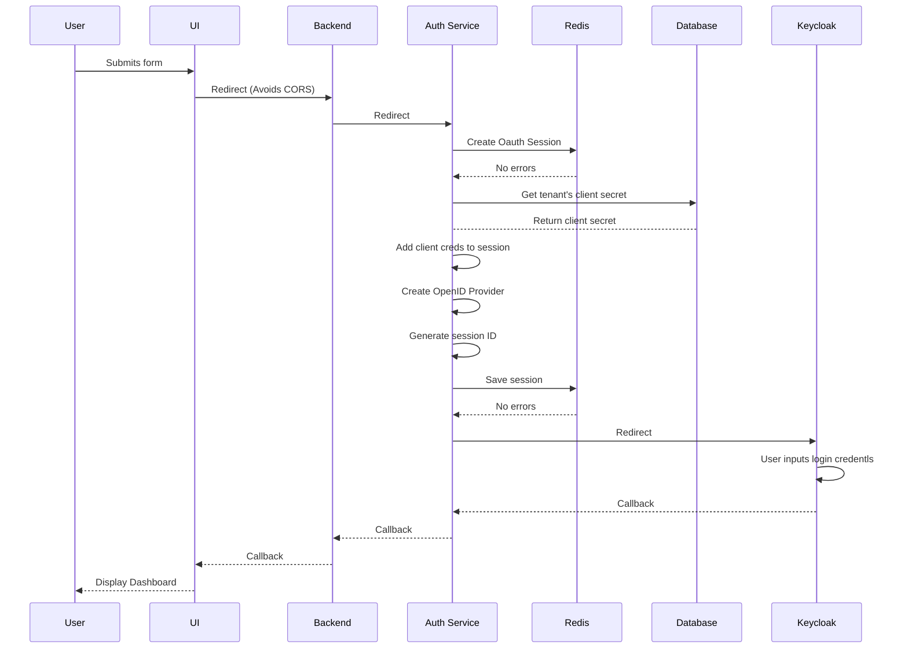
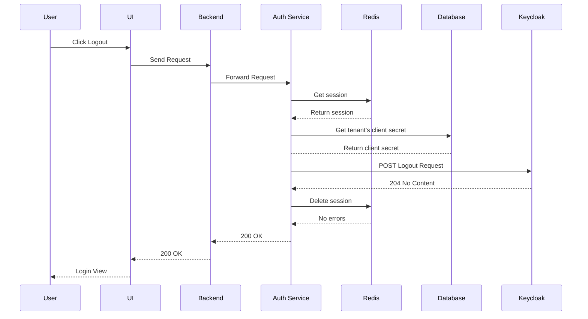

# Angela Auth Service

## Set up required services

- docker compose -f docker-compose.develop.yml up -d

## How to set up Keycloak

- go to http://localhost:8080
- go to Users
- click the admin user link
- update the email (use test email), first and last names
- check email verified
- click Save
- go to email tab
- click Realm Settings
- go to the Email tab
- update From to be the same test email as the admin user
- set host to smtp.gmail.com
- set port to 587
- check Enable StartTLS
- check Authentication enabled
- set username to the test email
- update password to the app password
- set UTF-8 to enabled
- click Save
- click Test Connection, ensure it worked

## Database

Below is the schema for the auth service, it is very simple and holds the information about tenants.

## Create Realm Sequence Diagram (Successful)

## Create Realm Sequence Diagram (Realm Already Exists)

## Login Sequence Diagram

## Logout Sequence Diagram

